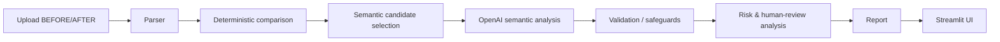

# AI-анализ организационной структуры и функционала

## 1. О проекте

Приложение сравнивает действующие и проектные внутренние документы при реорганизации, создании или ликвидации подразделений, передаче функций и актуализации положений. Оно показывает структурные и функциональные изменения, потенциальные риски и источники каждого существенного вывода.

## 2. Что делает AI-агент

1. Пользователь загружает документ ДО и документ ПОСЛЕ.
2. Система извлекает страницы и структурные пункты.
3. Deterministic layer сопоставляет пункты.
4. Semantic AI анализирует только релевантные изменения.
5. Агент классифицирует изменения, проверяет потенциальные потери, перераспределение и дублирование, валидирует источники и формирует сравнительную таблицу и аналитическое заключение.
6. Неоднозначные случаи направляются на human review.

Это hybrid approach: deterministic comparison + LLM semantic analysis + human-in-the-loop.

## 3. Поддерживаемые сценарии

MVP ориентирован на нормативные документы и поддерживает анализ создания подразделения, изменения его функций, потенциальной передачи функций, объединения/разделения, возможного упразднения и актуализации документов. Сложные many-to-one и one-to-many случаи могут потребовать проверки эксперта.

## 4. Архитектура



Модули: `app.py` — UI и orchestration; `src/parser.py` — PDF parsing и пункты; `src/models.py` — Pydantic-модели; `src/analyzer.py` — deterministic comparison; `src/semantic.py` — candidate selection, OpenAI, fallback и validation; `src/report.py` — таблица и заключение; `tests/test_core.py` — unit/mock-тесты.

## 5. Agentic AI

Решение является workflow, а не чат-ботом: получает задачу, извлекает структуру, выбирает кандидатов, использует AI только для ограниченных фрагментов, проверяет structured response и traceability, выделяет неопределённость и формирует отчёт.

## 6. Traceability и anti-hallucination

Каждый результат связывается с `document`, `page`, `clause_id`, `fragment_id`, `confidence`, типом `FACT`/`INFERENCE`/`RISK_FLAG`, флагом `requires_human_review` и методом `AI`/`deterministic`. AI может ссылаться только на реально существующие `fragment_id`; ссылки валидируются после ответа. Потеря функции не объявляется без достаточного подтверждения.

## 7. Технологии

Python, Streamlit, pypdf, pandas, Pydantic, OpenAI Python SDK, python-dotenv, pytest.

## 7.1 Поддерживаемые форматы входных документов

- PDF — извлечение с page/clause traceability;
- DOCX — paragraph/table/clause traceability;
- XLSX — sheet/row/cell traceability.

Формат `.xls` не поддерживается текущим parser-слоем: используйте `.xlsx`. Независимо от формата документ приводится к единой внутренней модели фрагментов, после чего используется общий analyzer.

## 8. Структура проекта

```text
app.py  requirements.txt  .env.example  .gitignore  README.md
src/
  __init__.py  analyzer.py  models.py  parser.py  report.py  semantic.py
tests/test_core.py
data/sample/
  Положение_о_внутреннем_аудите_редакция_8_обезличено.docx.pdf
  Положение_о_внутреннем_аудите_редакция_9_обезличено.docx.pdf
```

## 9. Установка

```powershell
git clone https://github.com/BAITC-Hacks/hack-462c549c-aiva.git
cd hack-462c549c-aiva
python -m venv .venv
.venv\Scripts\Activate.ps1
python -m pip install -r requirements.txt
```

`openai>=3,<4` соответствует текущему вызову `OpenAI(...).chat.completions.create(...)`.

## 10. Настройка OpenAI API

```powershell
$env:OPENAI_API_KEY="YOUR_KEY"
$env:OPENAI_MODEL="gpt-4o-mini"
```

Настоящий ключ нельзя помещать в код, README, `.env.example` или Git. `.env` исключён через `.gitignore`. Без ключа приложение продолжает работу в deterministic fallback режиме.

## 11. Запуск

```powershell
python -m streamlit run app.py
```

Стандартный адрес Streamlit: [http://localhost:8501](http://localhost:8501).

## 12. Использование

Загрузите BEFORE и AFTER, нажмите «Провести анализ», затем просмотрите structural changes, comparison table, risks, human review и итоговое заключение. В таблице доступны источники, confidence, semantic status и метод анализа.

## 13. Semantic statuses

`смысл сохранен`; `редакционное изменение`; `функция уточнена`; `функция расширена`; `функция сокращена`; `функция существенно изменена`; `потенциально перераспределена`; `потенциально потеряна`; `недостаточно данных / требуется проверка человеком`.

## 14. Тестирование

```powershell
python -m pytest -q
```

Тесты покрывают PDF parsing, clause detection, traceability, fallback, mock AI path, validation fragment IDs и sanitization диагностических сообщений.

## 15. Demo / контрольный сценарий

Используйте официальные PDF из `data/sample/`: редакцию №8 как BEFORE и №9 как AFTER. Система выявляет появление ДИТААД и ДОА, а также сохранение ДНМ и ДККМ. Спорные изменения сопровождаются источниками и могут быть направлены на human review.

## 16. Ограничения

Качество зависит от структуры PDF; semantic matching и сложные many-to-one/one-to-many изменения могут требовать human review. AI-выводы являются рекомендациями эксперту и не заменяют управленческое или юридическое решение.

## 17. Безопасность

API keys используются только через environment variables; `.env` не коммитится; диагностические сообщения sanitised; AI получает только выбранные semantic-фрагменты, а не весь документ целиком; traceability строится по исходным фрагментам.
