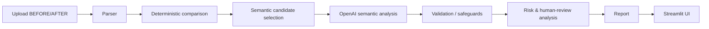

# AI-анализ организационной структуры и функционала

## 1. О проекте

Приложение сравнивает действующие и проектные внутренние документы при реорганизации, создании или ликвидации подразделений, передаче функций и актуализации положений. Оно показывает структурные и функциональные изменения, потенциальные риски и источники каждого существенного вывода.

## 2. Что делает AI-агент

1. Пользователь загружает документ ДО и документ ПОСЛЕ.
2. Система извлекает страницы и структурные пункты.
3. Deterministic layer сопоставляет пункты.
4. Semantic AI анализирует только релевантные изменения.
5. Агент классифицирует изменения, проверяет потенциальные потери, перераспределение и дублирование, валидирует источники и формирует сравнительную таблицу и аналитическое заключение.
6. Неоднозначные случаи направляются на human review.

Это hybrid approach: deterministic comparison + LLM semantic analysis + human-in-the-loop.

## 3. Поддерживаемые сценарии

MVP ориентирован на нормативные документы и поддерживает анализ создания подразделения, изменения его функций, потенциальной передачи функций, объединения/разделения, возможного упразднения и актуализации документов. Сложные many-to-one и one-to-many случаи могут потребовать проверки эксперта.

## 4. Архитектура



Модули: `app.py` — UI и orchestration; `src/parser.py` — PDF parsing и пункты; `src/models.py` — Pydantic-модели; `src/analyzer.py` — deterministic comparison; `src/semantic.py` — candidate selection, OpenAI, fallback и validation; `src/report.py` — таблица и заключение; `tests/test_core.py` — unit/mock-тесты.

## 5. Agentic AI

Решение является workflow, а не чат-ботом: получает задачу, извлекает структуру, выбирает кандидатов, использует AI только для ограниченных фрагментов, проверяет structured response и traceability, выделяет неопределённость и формирует отчёт.

## 6. Преимущества решения

### Responsible AI by design

Система сознательно разделяет машинный анализ, рекомендацию и человеческое решение:

```text
AI Agent
   ↓
Finding
   ↓
Evidence
   ↓
Recommendation
   ↓
Human Review
   ↓
Human Decision
```

ИИ-агент анализирует документы, обнаруживает изменения, сопоставляет функции, выявляет потенциальные риски, предоставляет evidence/source и формирует рекомендации. Он не утверждает организационные решения и не подменяет ответственного сотрудника. Это обеспечивает подконтрольность, прослеживаемость и сохранение ответственности человека.

## 7. Ответственность и роль человека

Ключевой принцип проекта: **AI recommends — Human decides**.

Human-in-the-loop — это не признак того, что AI «не справился», а safety/governance mechanism. Если вывод неоднозначен, имеет недостаточную доказательную базу или касается изменения ответственности, система не должна самоуверенно принимать решение. Она:

1. фиксирует неопределённость;
2. показывает документы ДО и ПОСЛЕ;
3. предоставляет источник и traceability;
4. предлагает рекомендацию;
5. передаёт решение ответственному сотруднику.

Окончательное решение по неоднозначным и значимым изменениям принимает человек. В соответствии с принципами [Закона Республики Казахстан от 17 ноября 2025 года № 230-VIII ЗРК «Об искусственном интеллекте»](https://adilet.zan.kz/rus/docs/Z2500000230) система построена с сохранением человеческого контроля и ответственности. ИИ формирует аналитические выводы и рекомендации, тогда как окончательное решение по результатам анализа остаётся за ответственным сотрудником.

Для архитектуры особенно релевантны:

- статья 8 — ответственность и подконтрольность системы;
- статья 9 — приоритет благополучия человека, автономии и свободы воли в принятии решений;
- статья 17 — классификация по степени автономности, включая системы низкой автономности, формирующие рекомендации или варианты решений при сохранении окончательного выбора и действий за человеком.

Это описание отражает архитектурный принцип проекта и не является юридическим заключением.

## Ответственный ИИ: решение остаётся за человеком

Ключевой принцип AIVA:

> **AI recommends — Human decides.**

AIVA используется как инструмент анализа и поддержки принятия решений, а не как замена ответственному сотруднику. Чтобы итоговое решение можно было понять и проверить, система показывает не только рекомендацию, но и основания, на которых она сформирована.

Для каждого существенного результата AIVA стремится сохранять цепочку:

**Входной документ → исходный фрагмент → сопоставление ДО/ПОСЛЕ → AI-анализ → вывод → рекомендация → решение сотрудника**

### Почему это важно

Ответственный сотрудник должен иметь возможность установить:

- какие документы и редакции использовал AI;
- какой пункт или фрагмент стал основанием вывода;
- что изменилось между ДО и ПОСЛЕ;
- почему изменение классифицировано определённым образом;
- какую рекомендацию сформировала система;
- какие результаты требуют экспертной проверки;
- какое окончательное решение принял сотрудник.

Поэтому Human-in-the-loop в AIVA — не просто fallback на случай неуверенности модели, а элемент governance-архитектуры. Если вывод неоднозначен или затрагивает распределение ответственности, система не скрывает неопределённость и не принимает организационное решение автоматически. Результат передаётся ответственному сотруднику вместе с исходными данными и evidence.

### Прослеживаемость и воспроизводимость

Связь результата с источником создаёт основу для последующей проверки ответственным сотрудником, внутренним контролем, внутренним или внешним аудитом, анализа инцидента, разбора спорного AI-решения и последующего сравнения редакций документов.

Цель — обеспечить возможность восстановить:

**какие входные данные были использованы → какие изменения обнаружены → на каком основании сформирован вывод → какое решение было принято человеком.**

Это делает работу AI более объяснимой, контролируемой и проверяемой.

### Разделение ролей

| AI-агент | Ответственный сотрудник |
| --- | --- |
| Анализирует документы | Оценивает результат анализа |
| Сопоставляет ДО/ПОСЛЕ | Проверяет контекст |
| Выявляет изменения и потенциальные риски | Подтверждает или корректирует вывод |
| Показывает evidence/source | Принимает итоговое решение |
| Формирует рекомендацию | Несёт ответственность за принятое решение |

Архитектура AIVA построена на принципе сохранения человеческого контроля: AI выполняет аналитическую и рекомендательную функцию, тогда как окончательное решение остаётся за ответственным сотрудником.

## 8. Traceability и anti-hallucination

Каждый результат связывается с `document`, `page`, `clause_id`, `fragment_id`, `confidence`, типом `FACT`/`INFERENCE`/`RISK_FLAG`, флагом `requires_human_review` и методом `AI`/`deterministic`. AI может ссылаться только на реально существующие `fragment_id`; ссылки валидируются после ответа. Потеря функции не объявляется без достаточного подтверждения.

## 9. Технологии

Python, Streamlit, pypdf, pandas, Pydantic, OpenAI Python SDK, python-dotenv, pytest.

### 9.1 Поддерживаемые форматы входных документов

- PDF — извлечение с page/clause traceability;
- DOCX — paragraph/table/clause traceability;
- XLSX — sheet/row/cell traceability.

Формат `.xls` не поддерживается текущим parser-слоем: используйте `.xlsx`. Независимо от формата документ приводится к единой внутренней модели фрагментов, после чего используется общий analyzer.

## 10. Структура проекта

```text
app.py  requirements.txt  .env.example  .gitignore  README.md
src/
  __init__.py  analyzer.py  models.py  parser.py  report.py  semantic.py
tests/test_core.py
data/sample/
  Положение_о_внутреннем_аудите_редакция_8_обезличено.docx.pdf
  Положение_о_внутреннем_аудите_редакция_9_обезличено.docx.pdf
```

## 11. Установка

```powershell
git clone https://github.com/BAITC-Hacks/hack-462c549c-aiva.git
cd hack-462c549c-aiva
python -m venv .venv
.venv\Scripts\Activate.ps1
python -m pip install -r requirements.txt
```

`openai>=3,<4` соответствует текущему вызову `OpenAI(...).chat.completions.create(...)`.

## 12. Настройка OpenAI API

```powershell
$env:OPENAI_API_KEY="YOUR_KEY"
$env:OPENAI_MODEL="gpt-4o-mini"
```

Настоящий ключ нельзя помещать в код, README, `.env.example` или Git. `.env` исключён через `.gitignore`. Без ключа приложение продолжает работу в deterministic fallback режиме.

## 13. Запуск

```powershell
python -m streamlit run app.py
```

Стандартный адрес Streamlit: [http://localhost:8501](http://localhost:8501).

## 14. Использование

Загрузите BEFORE и AFTER, нажмите «Провести анализ», затем просмотрите structural changes, comparison table, risks, human review и итоговое заключение. В таблице доступны источники, confidence, semantic status и метод анализа.

## 15. Semantic statuses

`смысл сохранен`; `редакционное изменение`; `функция уточнена`; `функция расширена`; `функция сокращена`; `функция существенно изменена`; `потенциально перераспределена`; `потенциально потеряна`; `недостаточно данных / требуется проверка человеком`.

## 16. Тестирование

```powershell
python -m pytest -q
```

Тесты покрывают PDF parsing, clause detection, traceability, fallback, mock AI path, validation fragment IDs и sanitization диагностических сообщений.

## 17. Demo / контрольный сценарий

Используйте официальные PDF из `data/sample/`: редакцию №8 как BEFORE и №9 как AFTER. Система выявляет появление ДИТААД и ДОА, а также сохранение ДНМ и ДККМ. Спорные изменения сопровождаются источниками и могут быть направлены на human review.

## 18. Ограничения

Качество зависит от структуры входного документа; semantic matching и сложные many-to-one/one-to-many изменения могут требовать human review. AI-выводы являются рекомендациями эксперту и не заменяют управленческое или юридическое решение.

## 19. Roadmap

Развитие системы сохраняет тот же принцип человеческой ответственности:

```text
AI finding
    → Human decision
    → revised document
    → AI re-validation
    → residual risk
```

Даже при дальнейшем развитии автономности финальное организационное решение не должно автоматически подменять решение ответственного сотрудника без соответствующего правового и организационного основания.

## 20. Безопасность

API keys используются только через environment variables; `.env` не коммитится; диагностические сообщения sanitised; AI получает только выбранные semantic-фрагменты, а не весь документ целиком; traceability строится по исходным фрагментам.
